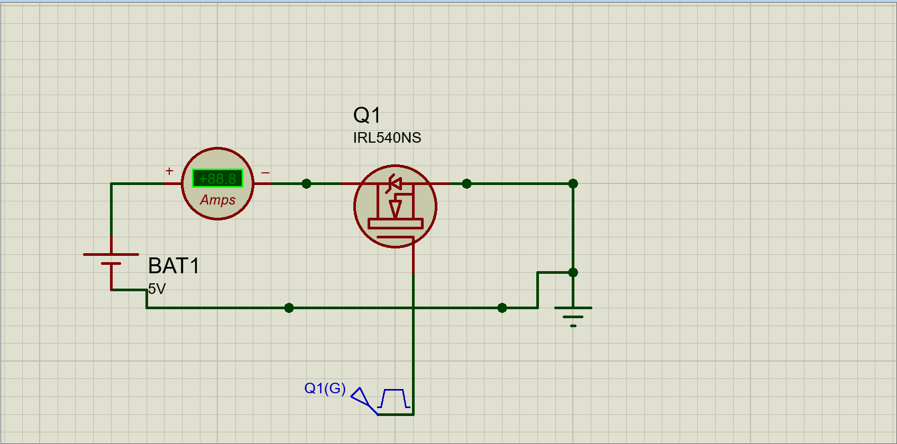

# THE SCHEMATICS FOR MOVING FROM 3.3V TO 5V USING A MOSFET

    The project files ending in .pdsprj  are proteus files so you will need it to open the project and the .workspace file is the configuration of my environment in proteus to ensure the project is as reprodusable as possible.

    The schematic is seen down below which shows the the general layout of the project. I made it as minimal as possible tobe free to modification

where 
1. IRL540NS is the MOSFET
1. Q1(G) is a 3.3V DC pulse generator to mimic an ESP 32
1. BAT 1 is a 5V DC voltage source
1. The ammeter was added to detect the presence of current
A video of the simulation is found at
<!-- [video](./images/VID_20220614_181658.mpL4)  -->
## incase of error the video is in the repo at ./images/VID_20220614_181658.mp

